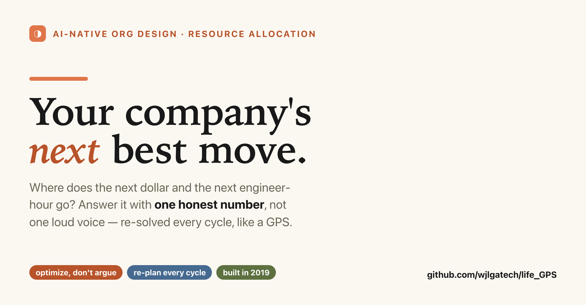
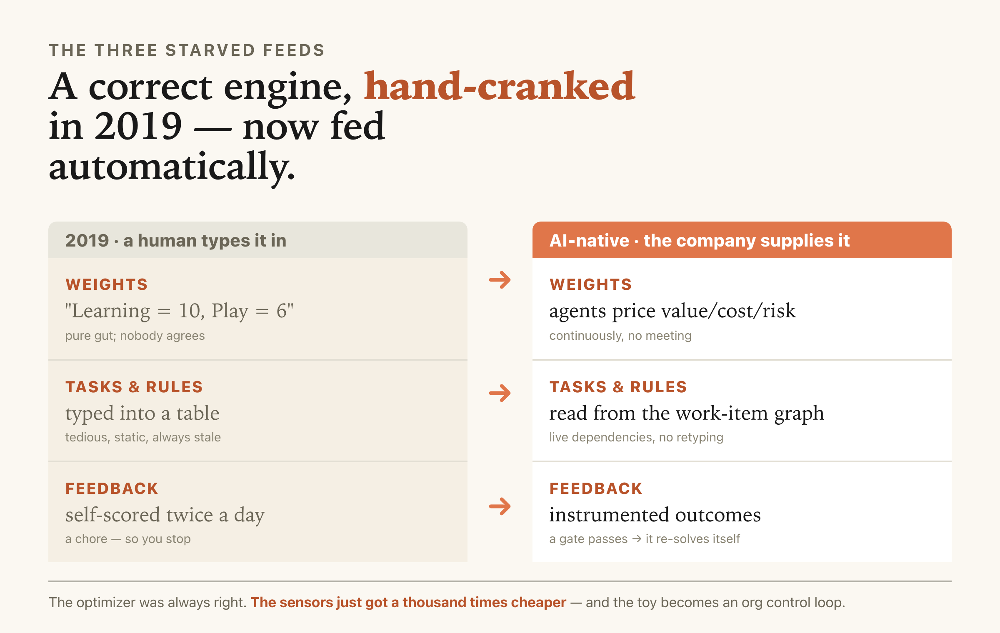
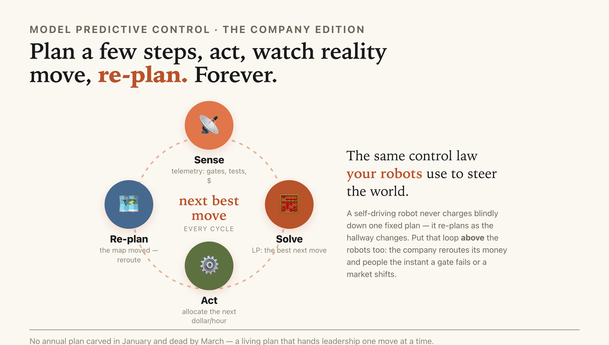

# I Built My Company's Brain in 2019 and Mistook It for a To-Do List

*How a physical-AI company should allocate resources across software, hardware, R&D, marketing, sales, and manufacturing — by re-solving "the best next move" every cycle, the same way its robots replan their path.*



Here's a question every founder and every CEO is secretly bad at answering:

**We have software, hardware, frontier R&D, marketing, sales, and manufacturing. There's one pot of money and one pool of engineer-hours. Where does the *next* dollar and the *next* hour go?**

Most companies answer this the way a caveman answers everything: **whoever argues loudest wins.** There's even a name for it in Silicon Valley — the **HiPPO**, the *Highest-Paid Person's Opinion.* The VP who tells the best story gets the headcount. That's not strategy. That's improv.

I want to show you the real answer — and then confess that I already built it six years ago and didn't understand what I was holding.

## First, the trap: "do we go deep or go wide?"

When I ask engineers this allocation question, they reach for a familiar picture: a tree. *Do we go **depth-first** — commit hard down one branch until we hit a result — or **breadth-first** — advance every branch a little at a time?* Depth-first vs breadth-first. DFS vs BFS. It feels right.

It's a trap, and it's worth seeing why, because the mistake is instructive.

Graph traversal answers *"in what order do I visit each node?"* — and it visits each node **exactly once.** But allocating a budget isn't visiting. You don't "visit" the sales team; you *pour* a divisible, capped resource into it and measure what comes back. Depth-first and breadth-first are just the same underlying machine with the dial jammed to two dumb extremes: DFS is "always the newest branch," BFS is "always the oldest." Both ignore the only thing that matters — **which branch is worth the most right now.**

So the honest correction — and I'll happily eat my own earlier framing here — is this: **the answer was never the traversal order. It's the objective and the constraints.** The tool isn't graph search. It's **optimization.** And this is a 70-year-old, boring, *solved* class of problem. You just have to recognize your company as an instance of it.

## The confession: I built this in 2019 and called it "Life GPS"

Six years ago I was drowning — too many things to learn, too few hours, and every rigid weekly plan died by Wednesday. So I built a little app to fix *me*. I called it **Life GPS** ([it's on GitHub](https://github.com/wjlgatech/life_GPS)), and the pitch was simple: *a planner that tells you the next best step, no matter how many turns you miss — like a GPS.*

Under the cute UI was a **Binary Integer Linear Program.** In plain words: it treats your week as a grid of hour-slots, and it flips each slot on or off for a task, to **maximize how much of what matters actually gets done**, subject to hard rules — each task needs a minimum but caps out at a maximum, one thing per hour, don't schedule past a deadline. A solver finds the single best filling of the grid. That's it. That's the whole brain — and swap "hour-slots" for "engineer-hours and dollars" and it's a company:

```
maximize    Σ  value(department) × resource(department)   # the best next move
subject to  each team-hour spent only once                # no double-booking
            each effort ≥ floor,  ≤ cap                    # min viable, don't over-invest
            respect dependencies + deadlines               # the graph
then RE-SOLVE every cycle as reality reports back          # ← the GPS reroute (MPC)
```

That last line is the whole trick. Everything above it is a plan; that line makes it a *living* plan.

And here's the part that gives me chills now. When you told it what *actually* happened — "I only got 40 minutes of deep work this morning, not two hours" — and hit **Update My Plan**, it did something specific: it **froze the past, subtracted what you'd already spent from every remaining budget, and re-solved the rest of the week from scratch.**

That has a name in robotics. It's called **Model Predictive Control** — *plan, act, watch reality move, re-plan from where you actually are.* It is the exact control law a self-driving robot uses to replan its path when a box appears in the hallway. **I had written org-level MPC in a weekend and mistook it for a productivity app.**

There's even a ghost in that old code: a feature I commented out because I couldn't make it work. A rule for *"work on this at least 3 days but no more than 5"* — my clumsy attempt to encode the real tension behind DFS-vs-BFS: **focus vs. variety.** My 2019 solver choked on it (it's a nonlinear constraint). A modern solver eats it for breakfast. The thing I gave up on is now a one-liner.

## Why it stayed a toy — and why that's the whole opportunity

Life GPS was *correct.* It never left my laptop for one reason: **it was starved of three things a human had to type in by hand.**



1. **The weights.** I typed in "Learning = 10, Play = 6." Pure gut. In a company, *nobody agrees on these numbers, and they decide everything.*
2. **The tasks and rules.** Typed into a table by hand. Tedious, static, always stale.
3. **The feedback.** I had to self-score twice a day. A chore, so I stopped.

Every one of those three was a **human crank.** And every one of them is exactly what an AI-native company now turns automatically:

- **Weights** → **agents estimate them.** An AI reads the evidence and prices each initiative's expected value, cost, and risk — continuously, cheaply, without a meeting.
- **Tasks and rules** → **read straight from the org.** The company already tracks its work as a graph of items with dependencies; the optimizer reads it instead of asking you to retype it.
- **Feedback** → **instrumented.** A test passing, a robot's error rate dropping, a contract closing — the "Update My Plan" button fires *itself.*

That's the whole thesis in one sentence: **Life GPS was a right answer starved of three data feeds, and the AI-native age serves all three for free.** The idea didn't get smarter. The sensors got a thousand times cheaper.

## The punchline for a robotics company

Here's the line I can't stop thinking about:

**A physical-AI company should steer itself with the same algorithm its robots use to steer through the world.**

Your robots don't compute one perfect plan and charge blindly ahead. They sense, plan a few steps, act, sense again, and re-plan — forever. **That is exactly how the company above them should allocate its money and its people.** Not an annual plan carved in stone in January and dead by March. A living GPS that, every cycle, hands leadership *the single best next move* — and reroutes the instant a gate fails, a market shifts, or a big hire lands.



The medium is the message. If you believe in closed-loop control enough to put it inside your robots, put it inside your company too.

## What this actually solves (the bigger problem)

Step back and the small idea points at a big one. "Where does the next dollar go?" is the same math as a robot planning a path, a fund balancing a portfolio, and an AI deciding explore-vs-exploit. They're **one problem** — allocate a scarce resource under uncertainty to maximize value — and for the first time we can *run* it at company scale, because the three feeds that used to need a human are now automatic.

The catch, and I won't pretend otherwise: **it all rides on the weights.** Feed the optimizer garbage estimates and it will march you off a cliff *with a certificate of optimality* — confidently wrong is worse than roughly right. So the honest first step isn't to build the engine. It's to **prove the estimates are trustworthy** — take six past decisions, have an AI price them using only what was knowable at the time, and see if the math would have picked what actually worked. One afternoon. It either earns the whole system or tells you the real product is the estimator. That's not a detour. That's the discipline.

I spent 2019 building a GPS to get my own week under control. It turns out I was building the thing a company needs to get *itself* under control. I just had to wait for the world to catch up to the code.

**Where does your next dollar go — and could your company answer that in one honest number instead of one loud voice?**

---

*This is part of a series on building an AI-native physical-AI company — after "Ship a loop, not a demo" and "You Can't Order People to Close Loops." Full article on my own site, with the strategy plan behind it — link below. Curious how you'd answer the next-dollar question: share your rule in the comments.*

#PhysicalAI #Robotics #AInative #ResourceAllocation #Leadership #OperationsResearch #AIStrategy
