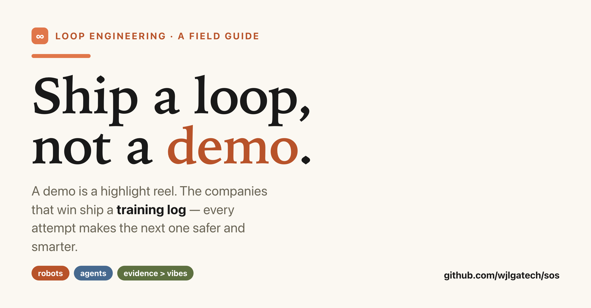
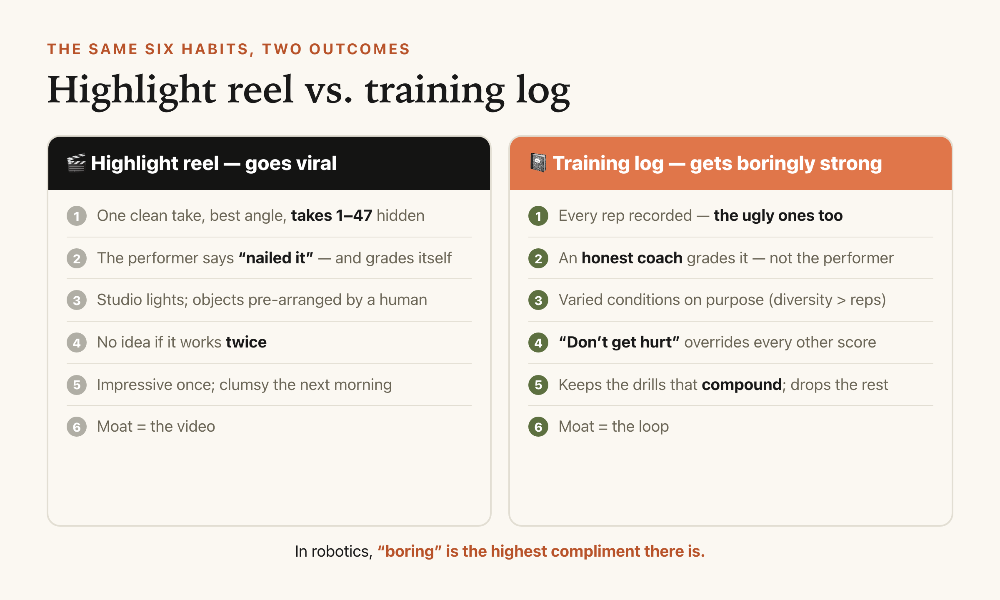
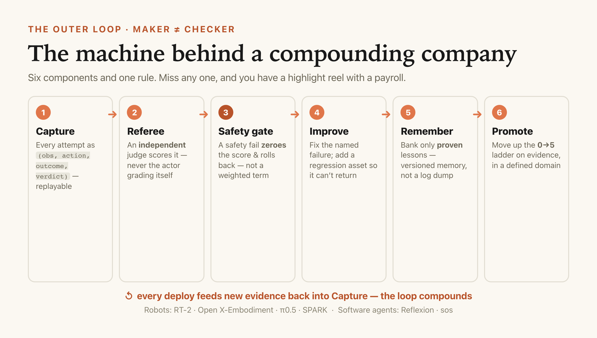

# Ship a Loop, Not a Demo

*Why the best AI companies are boring on purpose — a field guide from robots to software agents, with the exact machinery an engineer can build tomorrow.*



---

Somewhere right now, a robotics startup is filming a demo.

The lighting is perfect. The objects are arranged like a still life. The robot picks up the mug, and the room erupts. Cut. Upload. Caption: *"The future is here."* Forty thousand likes by lunch.

What you don't see, just outside the frame, are three engineers holding their breath — and a folder on someone's laptop called `takes_1_through_47`.

I love these videos. I also know a quiet, expensive truth about them:

> **A demo is a highlight reel. And gravity never signed the API agreement.**

The robot that nailed the mug once, under studio lights, with the cups pre-spaced by a human who then tiptoed out of frame — that robot has learned exactly one thing: how to succeed in that exact room. Move the mug two inches, dim the lights, add a second cup, and it will reach for the future with the confidence of a Roomba discovering stairs.

Here's the reframe this whole post is about, and it's the difference between a hardware startup with a great trailer and a company that actually compounds:

**The winners don't ship a demo. They ship a *loop* — a system that turns every real-world attempt into a safer, more capable next attempt.**

Let me give you a mental model a 15-year-old can hold, and then hand an engineer the exact parts list to build it.

## The mental model: highlight reel vs. training log

Think about two kids learning to lift.

**Kid A** posts a highlight reel. One clean rep, filmed from the good angle, two spotters just off-screen, chalk dust catching the light. It looks incredible. You have no idea if he can do it twice.

**Kid B** keeps a training log. *Every* rep — the ugly ones too. A coach who refuses to count a rep where his back rounded, no matter how much weight was on the bar. One rule that overrides all others: **don't get hurt.** He keeps the drills that actually made him stronger and throws out the ones that just felt cool. And he only moves up a weight class when he can *actually lift it* — not when he *feels* ready.

Kid A goes viral. Kid B gets *boringly* strong.

In robotics, boring is the highest compliment there is. A robot that does the same safe thing correctly 10,000 times is worth infinitely more than one that does a backflip once for LinkedIn. The whole game is turning Kid A's mixtape into Kid B's training log.



## Now the part your engineer wants: term by term

A mental model that doesn't map to real components is just a nice feeling. So here's the mapping — every piece of the gym on the left, the exact system on the right. An engineer should be able to read the right column and start opening files.

| The gym (what a 15-year-old pictures) | The system (what an engineer builds) |
|---|---|
| The **highlight reel** you post | A **demo** — a cherry-picked eval on a rehearsed scene |
| The **training log** with every rep | **Episode capture**: a record of `(observation, action, outcome, verdict)` per attempt — RLDS-style tuples in robotics; a run-ledger for a software agent |
| The **honest coach** who won't count a bad rep | An **independent referee** — *maker ≠ checker*. The policy that acted does **not** grade itself; a separate evaluator verifies against real evidence |
| **"Don't get hurt"** overrides everything | **Safety as a terminal gate** — a safety failure zeroes the score regardless of any other metric, and the change rolls back |
| Keeping the **drills that made you stronger** | **Curated capability memory** — versioned, *proven* lessons the next run inherits (not a log dump) |
| Moving up a **weight class** only when you can lift | The **autonomy / release ladder** — promote a capability 0→5 on measured evidence, in a defined operating domain |
| The **honest scoreboard** on the wall | Your north-star metric: **human-minutes per useful robot-hour** (for software agents: verified ROI per run) |

Read the right column top to bottom. That's not a metaphor anymore — that's an architecture. Six components and one metric. If your "AI strategy" doesn't have all seven, you have a highlight reel with a payroll.

And it's smaller than it sounds. Here's the whole outer loop in about fifteen lines of pseudocode — the same shape whether the "policy" is a robot or a coding agent:

```python
def outer_loop(policy, referee, memory, task):
    episode = run(policy, task)            # 1. Capture: obs, action, outcome
    verdict = referee.grade(episode)       # 2. Referee: maker != checker
    if verdict.safety_violation:           # 3. Safety gate is terminal
        return rollback(policy)            #    a safety fail zeroes everything
    if verdict.score <= best_so_far(task): # accept only real improvement
        return rollback(policy)            #    (regression control)
    memory.commit(verdict.lesson)          # 4-5. Improve + remember (proven only)
    if verdict.clears_bar(next_level):     # 6. Promote on evidence,
        promote(policy, task, next_level)  #     up the 0->5 ladder
    return policy                          # ...and the next attempt starts smarter
```

The magic isn't any single line. It's that `referee` is a *different object* than `policy`, and that the safety check `return`s before anything else can. Everything else is bookkeeping — but that bookkeeping is the company.

## "But surely the model is the moat?" — what the research actually says

Here's where it gets fun, because the evidence points somewhere counterintuitive: **the moat isn't the model. It's the loop that feeds it.**

- **Bigger, more general brains do transfer.** Google DeepMind's **RT-2** (2023) expressed robot actions as *tokens* and co-trained a vision-language model on both robot data and internet-scale vision-language tasks — and reported improved generalization to novel objects and instructions. A general brain helps. Nobody's arguing otherwise.
- **But diversity beats repetition — by a lot.** The **Open X-Embodiment / RT-X** collaboration (2023) pooled data across **22 robot types, 21 institutions, 527 skills, and 160,000+ tasks**, and found *positive transfer across robot bodies* when a high-capacity model learned from the mix. A separate real-world manipulation study found that improvement scaled roughly with the **diversity** of environments and objects — not with piling on more repetitions of the same demo past a threshold. Translation: a thousand reps of "grab the blue box off the same table" makes a robot with strong opinions about blue boxes. Then a brown box appears and it has an existential crisis.
- **Generalization comes from combining sources, not one hero policy.** Physical Intelligence's **π0.5** (2025) leaned on heterogeneous co-training — multiple robots, semantic prediction, web data — and reported long-horizon manipulation in homes it had *never seen*. The lesson keeps rhyming: broad competence is a *portfolio* property, not a single-checkpoint property.
- **And safety isn't a score — it's a gate.** Humanoid safety work like the **SPARK** benchmark treats safety as modular, testable criteria integrated with the real controller — not one weighted term you can out-vote with speed. Because a robot that's fast but unsafe isn't a high-performing robot. It's a high-speed incident report.

None of these are model *tricks*. They're properties of the **data-and-evaluation loop** wrapped around the model. The team with the better loop wins even with the same open weights — because next Tuesday, their robot is measurably better and yours is exactly as clumsy as it was on Sunday.

## This isn't a robot thing. It's an *everything* thing.

Swap "robot" for "software agent" and the entire diagram survives.

Your coding agent that ran for six hours and produced zero commits? That's a robot that looked busy under studio lights. **Reflexion** (Shinn et al., 2023) showed language agents improve when they *reflect on verified feedback and carry the lesson forward* — the exact training-log move, minus the gravity. Capture the run, let an independent check grade it (not the agent's own self-congratulation), keep what compounds, gate on safety, and the agent gets boringly reliable too.

I'll show my hand: the framework this post lives in — **sos** — is that loop for software. It watches agents for *real filesystem evidence* instead of self-reported vibes, scores output against explicit criteria (**maker ≠ checker**, in code), and banks what it learns. The marketing-eval engine in this very repo scored *this article* with arithmetic, not a gut feeling, before a human ever read it. The loop is turtles all the way down, and that's the point.



## The one-week test (culture first, contract later)

You don't need a moonshot to start. You need to stop shipping reels.

Pick one task. Put up a public board of your open loops — the checks you'd fail, the workflows that burn the most human minutes. Let anyone claim one, run *one* bounded experiment with an independent metric, and celebrate the first **verified** improvement — not the flashiest proposal, the *verified* one. Do it with humans in the loop before you automate a single thing.

Because here's the honest ending, and it's the whole thesis in one breath:

**Build the loop, and your robots — or your agents — get a little less clumsy every night while you sleep. Skip it, and you'll own something charming that waves, folds a towel once, and is, underneath the demo, a very expensive toaster with legs.**

So the only question that matters this quarter isn't "how good is our model?"

It's: **are we shipping a highlight reel, or a training log?**

---

*I build loop-engineering tooling in the open — sos (self-monitoring agents + a computed marketing-eval engine) is one piece of it. If you're wrestling with the demo-to-loop jump on your own team, tell me what breaks first in the comments; I read every one.*

**→ Star / read the loop:** github.com/wjlgatech/sos

*#AI #Robotics #MachineLearning #AIAgents #LoopEngineering #BuildInPublic*

---

### References (all real, all searchable)

- **RT-2: Vision-Language-Action Models Transfer Web Knowledge to Robotic Control** — Google DeepMind, 2023.
- **Open X-Embodiment: Robotic Learning Datasets and RT-X Models** — Open X-Embodiment Collaboration, 2023 (22 embodiments · 527 skills · 160k+ tasks).
- **π0.5: a Vision-Language-Action Model with Open-World Generalization** — Physical Intelligence, 2025.
- **SPARK: Safe Protective and Assistive Robot Kit / humanoid safety benchmarking** — 2024–2025.
- **Reflexion: Language Agents with Verbal Reinforcement Learning** — Shinn et al., NeurIPS 2023.

*Numbers are quoted as reported by the sources above; illustrative stories (the mug, the gym) are illustrative. If a claim here isn't traceable to one of these, treat it as opinion, not fact.*
