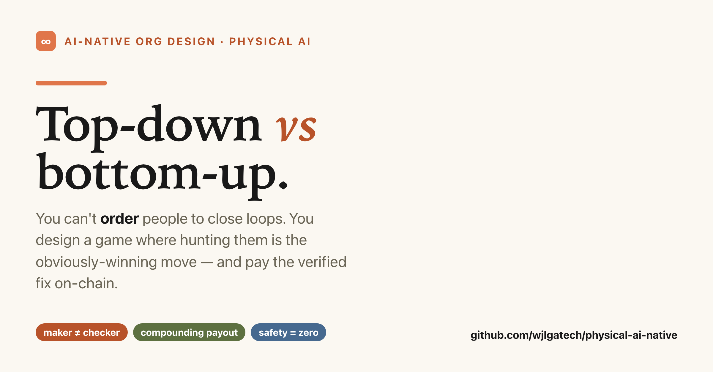
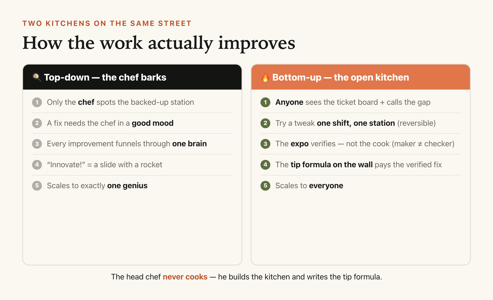
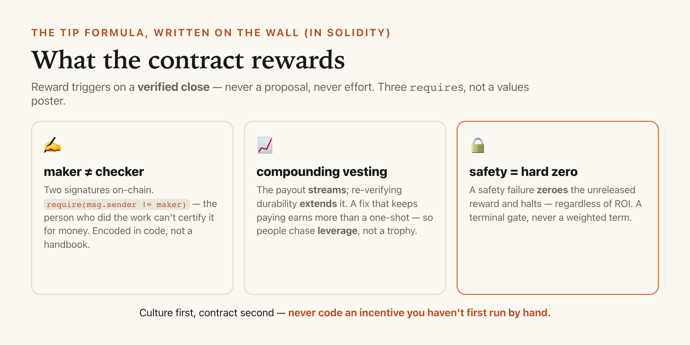

# You Can't Order People to Close Loops — So Stop Trying

*Top-down vs. bottom-up in an AI-native robotics company: why the winners design a game instead of barking orders — with the exact machinery, down to the smart contract, an engineer can build tomorrow.*



---

Here's a scene you've watched play out.

An executive stands up and announces the new strategy: **"Everyone here needs to innovate. Own it. Be entrepreneurial."** There's a slide. It has a rocket on it. Everyone nods, returns to their desk, and innovates precisely as much as they did the day before — which is to say, they wait to be told what to do.

Meanwhile, three miles away, a smaller robotics company's Titan-class robot is getting measurably less clumsy *every single night* — and nobody at the top assigned that. A floor technician noticed the gripper fumbling transparent cups under morning light, ran one experiment, and the fix is now paying out to her, automatically, on-chain.

That's the whole fight in one image. **Top-down tells people to close loops. Bottom-up makes closing loops the obviously-winning move — and gets out of the way.**

I've spent the last stretch building the runtime for the second kind of company (an AI-native Physical AI operating system). Let me give you the mental model a 15-year-old gets instantly, then hand your engineer the parts — including the Solidity.

## The mental model: two kitchens

Picture two restaurants on the same street.

**Kitchen A is top-down.** The head chef stands at the pass and barks. Grill backs up? He notices, eventually, and yells. A cook has an idea for faster prep? He has to catch the chef in a good mood. Nothing improves unless it flows through one overloaded brain. On a busy night, Kitchen A is a bottleneck wearing a toque.

**Kitchen B is bottom-up — the open kitchen.** Every cook can see the **ticket-time board**. When the grill backs up, *any* cook can call it and try a prep tweak for one shift, one station — bounded, reversible. The **expo** — not the cook who made the change — checks whether ticket time actually dropped. And the **tip formula is written on the wall**: a verified improvement pays automatically, more if it keeps paying off. The head chef in Kitchen B **never cooks.** He builds the kitchen, keeps the fridge cold and the knives sharp, and writes a tip formula that's fair and can't be gamed.

Kitchen A scales to exactly one genius. Kitchen B scales to everyone.



## Term by term — so your engineer can build Kitchen B

A metaphor that doesn't map to components is just a nice feeling. Here's the mapping — the CNO (Chief AI-Native Officer) is the head chef; everything else is a system.

| Kitchen B (what a 15-year-old pictures) | The system (what an engineer builds) |
|---|---|
| The **ticket-time board** everyone sees | An auto-surfaced **gap board** — a friction sensor + your readiness `No`s + the workflows burning the most human-minutes |
| Try a tweak **one shift, one station** | A **bounded closed-loop**: hypothesis + one metric + a rollback. Cheap to spin up; a safety gate keeps it off production |
| The **expo checks**, not the cook | An **independent referee** — *maker ≠ checker*. The person who made the change never certifies it |
| The **tip formula on the wall** | An on-chain **smart contract** that pays the *verified close* — never effort, never proposals |
| Paying **more when the fix keeps working** | **Compounding vesting** — the payout streams, and re-verifying durability extends it. People hunt leverage, not applause |
| "**Don't burn the place down**" overrides tips | A **safety-zero gate** — a safety failure zeroes the reward regardless of ROI |
| The head chef **never cooks** | The CNO builds infra + culture + the contract, and does *not* close loops for people (that just rebuilds the bottleneck) |

Read the right column. That's not a vibe — that's an org design. And the contract at the center is smaller than it sounds.

## The contract, in the language it actually lives in

The three non-negotiables aren't a values poster — they're `require` statements:

```solidity
// maker != checker — enforced in code, not in a handbook
function attestClose(uint256 id, uint256 reward) external {
    require(isChecker[msg.sender], "not a referee");
    require(msg.sender != closes[id].maker, "maker != checker"); // the whole point
    // ...fund a vesting stream that re-verification extends (compounding)
}

// safety is a terminal gate, not a weighted term
function flagSafety(uint256 id) external onlyGuardian {
    // zero the UNRELEASED reward and halt — regardless of ROI
}
```



If the person who did the work can sign off on their own result for money, they'll grade their own homework — so `maker != checker` is a line of Solidity, not a line in an onboarding deck. And you **reward compounding**, not one-shots: a fix that keeps lowering human-burden earns more, over time. That single knob is what makes people chase leverage instead of a bonus-shaped trophy.

## "But surely the smart people at the top should decide?" — what the robotics evidence says

Here's the counterintuitive part, and it's not a management opinion — it's what the research on *robots* keeps showing: **diversity beats a single directing intelligence.**

- **Open X-Embodiment / RT-X** (2023) pooled data across **22 robot types, 21 institutions, 527 skills, 160,000+ tasks** and found *positive transfer across robot bodies* — the model got better because the inputs were **varied**, not because one lab dictated them. A real-world manipulation study found improvement scaled with the **diversity** of environments and objects, not with piling on more repetitions of the same demo.
- **RT-2** (Google DeepMind, 2023) got its generalization by absorbing broad, uncurated web knowledge — not a hand-picked curriculum.
- **π0.5** (Physical Intelligence, 2025) reached homes it had *never seen* through **heterogeneous co-training** — many sources, combined.

Translation for your org chart: a company that funnels every improvement through the executive at the top is a robot trained on one blue box from one angle. It's supremely confident right up until a brown box appears — and then it has an existential crisis. **Bottom-up isn't the fluffy option. It's the one with the citations.**

The catch — and it's the whole reason top-down persists — is *trust*. Bottom-up only works if a bad idea can't do damage and a good idea can't be faked. That's exactly what the **independent referee** and the **safety-zero gate** buy you: a company can safely let everyone experiment *because* nothing ships unverified and nothing unsafe survives. Remove those two and "empower everyone" becomes "everyone's optimism, unfiltered" — which is how you get a robot that's very fast and very much an incident report.

## The honest sequence (don't skip it)

You do **not** start by writing Solidity. You start with a whiteboard: put up the open-loop board, let anyone claim a gap, run one experiment with an independent metric, and pay the first verified close from a **manual bounty**. Prove the game is fun and fair with humans in the loop. *Then* encode the exact payout math that worked. **Never code an incentive you haven't first run by hand** — the contract's only job is to make a proven culture permanent and un-gameable.

Because here's the ending, and it's the whole thesis in one breath:

**A top-down company is only as smart as the person at the top on their best day. A bottom-up company — with a referee and a safety gate — gets smarter every night while everyone sleeps.** Build the second one, and your robots get less clumsy on their own. Build the first, and you'll have a very expensive toaster with legs and an executive insisting, from the pass, that it's about to be brilliant.

So the question isn't "how do we get people to care?"

It's: **are we barking orders, or did we write the tip formula on the wall?**

---

*I build this in the open — a Physical-AI-native company OS (the roles, the operating-loop doctrine, the on-chain incentive sketch) and sos, the loop-engineering framework underneath. If you're stuck between top-down and bottom-up on your own team, tell me where it breaks in the comments — I read every one.*

**→ Read the incentive doctrine + the Solidity sketch — repo:** github.com/wjlgatech/physical-ai-native

*#PhysicalAI #Robotics #AInative #Web3 #Leadership #BuildInPublic*

---

### References (all real, all searchable)

- **Open X-Embodiment: Robotic Learning Datasets and RT-X Models** — Open X-Embodiment Collaboration, 2023 (22 embodiments · 527 skills · 160k+ tasks).
- **RT-2: Vision-Language-Action Models Transfer Web Knowledge to Robotic Control** — Google DeepMind, 2023.
- **π0.5: a Vision-Language-Action Model with Open-World Generalization** — Physical Intelligence, 2025.
- **Reflexion: Language Agents with Verbal Reinforcement Learning** — Shinn et al., NeurIPS 2023 (independent-feedback loops for agents).

*Numbers are quoted as reported by the sources above; the kitchens and the floor technician are illustrative. If a claim here isn't traceable to one of these, treat it as opinion, not fact.*
